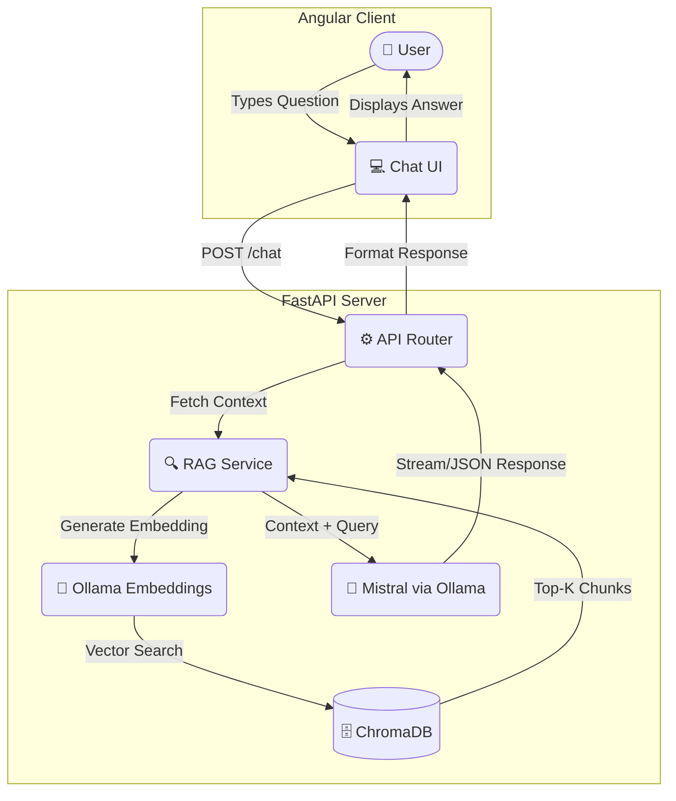

# 🎓 SRMIST Admission Assistant

[](https://angular.io/)
[](https://fastapi.tiangolo.com/)
[](https://www.python.org/)
[](https://ollama.ai/)
[](https://trychroma.com/)
[](https://mistral.ai/)

An enterprise-grade, AI-powered college admission chatbot built using **Retrieval-Augmented Generation (RAG)**. This system acts as a highly intelligent assistant for prospective students, providing accurate, grounded, and instant answers to complex queries regarding SRMIST admissions, courses, placement statistics, and campus life. 

By leveraging a locally hosted **Mistral LLM** via Ollama and a **ChromaDB** vector database, the application ensures complete data privacy (100% offline capability) while virtually eliminating AI hallucinations.

---

## ✨ Key Features

- **Intelligent RAG Pipeline**: Dynamically retrieves the most relevant college documents to ground the LLM's answers in factual data.
- **Persistent Chat History**: Automatically saves conversations locally, allowing users to resume past chat sessions seamlessly from the sidebar.
- **Source Citations**: Transparently displays the exact documents used to generate an answer, along with a calculated relevance percentage badge.
- **Dynamic UI/UX**: Features a sleek, modern glassmorphism design with typing skeletons, fade-in animations, and a thinking timer.
- **Bilingual & Context-Aware**: Capable of understanding complex, multi-turn conversations and responding appropriately.
- **100% Local & Private**: No API keys required, no data sent to cloud providers like OpenAI. The entire stack runs locally on your machine.
- **Robust Document Parsing**: Automatically ingests, cleans, and chunks text and PDF files to build the vector knowledge base.

---

## 🏗️ System Architecture

The application follows a modern decoupled architecture, separating the client-side UI from the heavy AI processing backend.



---

## 🛠️ Tech Stack & Tooling

| Layer | Technology | Purpose & Justification |
|-----------|------------|-------------|
| **Frontend UI** | Angular 22 | Chosen for its robust standalone components, TypeScript safety, and excellent state management. Utilizes custom CSS for a premium glassmorphism aesthetic. |
| **Backend API** | FastAPI | High-performance Python web framework. Chosen for its native asynchronous capabilities, crucial for handling long-running LLM generation requests without blocking. |
| **Large Language Model** | Mistral | A highly efficient, 7B parameter open-weight model running locally via Ollama. Chosen for its exceptional reasoning-to-size ratio. |
| **Vector Database** | ChromaDB | Lightweight, open-source vector database. Embedded directly into the Python application for simplified deployment without needing a separate Docker container. |
| **Embeddings**| Ollama (Nomic/Llama2) | Converts textual knowledge into high-dimensional vectors to enable semantic similarity search (Cosine Distance). |

---

## 📚 Knowledge Base Setup

The chatbot is currently trained on a highly detailed dataset specifically curated for SRMIST, including:
1. `srmist_admission_process.txt`: SRMJEEE details, dates, and counseling.
2. `srmist_campus_life.txt`: Clubs, Aaruush, Milan, and sports.
3. `srmist_departments.txt`: Engineering branches, specializations, and labs.
4. `srmist_facilities.txt`: Transportation, medical, hostels, and WiFi.
5. `srmist_faq.txt`: Common queries regarding attendance and grading.
6. `srmist_prospectus.txt`: Placement statistics, recruiters, and fee structures.

*Note: You can add any `.txt` or `.pdf` file to the `knowledge_base/` folder and trigger the `/reset` endpoint to automatically ingest it.*

---

## 🚀 Detailed Setup Instructions

### Prerequisites
Before you begin, ensure you have the following installed:
- [Node.js](https://nodejs.org/) (v18 or higher)
- [Python](https://www.python.org/) (v3.10 or higher)
- [Git](https://git-scm.com/)
- [Ollama](https://ollama.ai/) installed and running as a background service.

### 1. Configure the Local LLM
First, pull the required models into Ollama:
```bash
# Pull the generation model
ollama pull mistral

# (Optional) If using a specific embedding model
ollama pull nomic-embed-text 
```

### 2. Backend Initialization (FastAPI)
Open a terminal and set up the Python environment:
```bash
# Navigate to the backend directory
cd ai-chatbot-backend

# Create and activate a virtual environment
python -m venv venv

# On Windows:
venv\Scripts\activate
# On macOS/Linux:
source venv/bin/activate

# Install dependencies
pip install -r requirements.txt

# Start the server
uvicorn app.main:app --reload --port 8000
```
*Upon first startup, the backend will automatically parse the `knowledge_base/` folder, chunk the documents, generate embeddings, and build the ChromaDB database.*

### 3. Frontend Initialization (Angular)
Open a **new** terminal window:
```bash
# Navigate to the frontend directory
cd chatbot-ui

# Install Node dependencies
npm install

# Start the Angular development server
npx ng serve
```
Visit `http://localhost:4200` in your browser to interact with the assistant.

---

## 🔌 API Endpoints

The FastAPI backend exposes several REST endpoints:

- `GET /health` - Checks the connection status between FastAPI and the Ollama service.
- `GET /stats` - Returns statistics about the ChromaDB vector store (document count, chunk count).
- `GET /reset` - Wipes the vector database and completely rebuilds it from the `knowledge_base/` folder. Useful after adding new files.
- `POST /chat` - The primary RAG endpoint. Accepts a JSON payload containing the user's `message` and conversation `history`.

---

## 🧠 Deep Dive: How the RAG Implementation Works

1. **Ingestion & Chunking**: When the backend starts, it reads all files in the `knowledge_base/` directory. Because LLMs have a limited context window, the text is split into smaller "chunks" (e.g., 500 characters) with a slight overlap (to prevent cutting sentences in half).
2. **Embedding**: Each text chunk is passed through an embedding model, converting the text into an array of floating-point numbers (a vector) that represents its semantic meaning. These vectors are stored in ChromaDB.
3. **Retrieval**: When a user asks "What is the fee for B.Tech?", that question is embedded into a vector. ChromaDB performs a similarity search (Cosine Distance) to find the top $K$ chunks in the database that are closest in meaning to the question.
4. **Augmented Generation**: The system constructs a massive prompt containing the user's question, the conversation history, and the retrieved factual chunks. This prompt is sent to the Mistral LLM, ensuring the model's answer is strictly based on the provided context rather than its pre-trained (and potentially hallucinated) knowledge.

---

## 🔮 Future Roadmap
- [ ] Implement user authentication (JWT) and PostgreSQL for cloud-synced chat history.
- [ ] Add a web scraper script to automatically update the knowledge base from the university's official website.
- [ ] Containerize the application using Docker and Docker Compose for one-click deployments.
- [ ] Add multi-modal support (allowing users to upload their own documents directly in the chat UI).

---
**Created by**: Arin Tholia